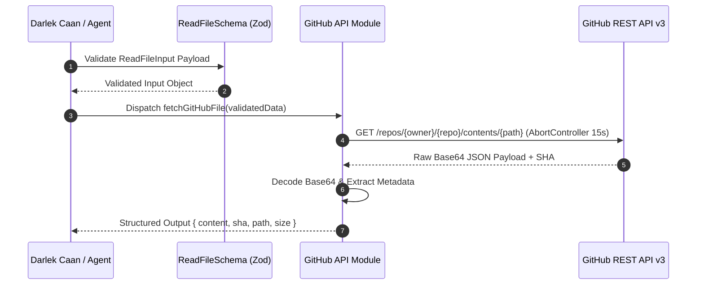
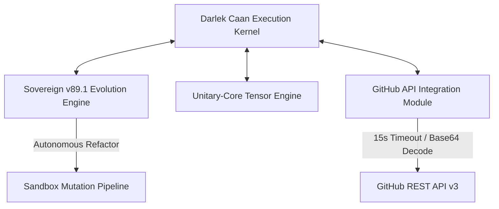

# ARCHITECTURAL BLUEPRINT: OMEGA-EMERGENT-INTELLIGENCE

> **System Designation:** `OMEGA-EMERGENT-INTELLIGENCE`  
> **Kernel Version:** `Core v89.1`  
> **Classification:** Autonomous Self-Refactoring Multi-Agent System  
> **Ecosystem Integration:** `Darlek Caan` & `Sovereign Evolution Engine v89.1`

---

## ⚡ Executive Summary

`OMEGA-EMERGENT-INTELLIGENCE` (Core v89.1) is an autonomous, self-refactoring multi-agent execution kernel driven by the **Huxley-Singularity-Loop** and integrated directly with the `Darlek Caan` core engine. The architecture employs a hardened data ingestion layer (GitHub REST API v3) featuring strict Zod schema validation, enforced 15-second network timeouts via `AbortController`, Base64 decoding, and cryptographic SHA tracking to drive secure, zero-downtime continuous code evolution.

---

## 📑 Table of Contents

1. [System Overview](#1-system-overview)
2. [Directory Topology](#2-directory-topology)
3. [Ingestion & Invariant Layer](#3-ingestion--invariant-layer)
4. [Security Protocols & Operational Safeguards](#4-security-protocols--operational-safeguards)
5. [Vulnerability Disclosure & Reporting](#5-vulnerability-disclosure--reporting)
6. [System Integration & Component Topology](#6-system-integration--component-topology)

---

## 1. System Overview

The `OMEGA` repository acts as the central execution kernel for the `Darlek Caan` ecosystem, orchestrating multi-agent collaboration and real-time evolutionary self-mutation. 

By consuming direct repository states through the GitHub API Integration Module, `OMEGA Core v89.1` evaluates source code integrity, generates deterministic refactoring vectors, and applies audited inline state shifts back to target codebases.

---

## 2. Directory Topology

The codebase maintains strict modular segregation between ingestion APIs, agent behaviors, self-mutation pipelines, and persistent state storage:

```
├── app/
│   └── api/
│       └── github/          # GitHub API integration layer (Schema, Service, Types)
├── src/
│   ├── agents/              # Multi-agent orchestrators & inter-agent communication protocols
│   ├── evolution/           # Autonomous mutation engines & fitness evaluation metrics
│   └── engine/              # Sovereign v89.1 core runtime and execution loop
├── persistence/             # SHA state snapshots, state-trees, and memory dumps
└── local-overrides/         # Environment-specific patches and sandbox overrides
```

| Directory | Purpose & Key Components |
| :--- | :--- |
| `app/api/github/` | REST API v3 ingestion service, `ReadFileSchema` validation, and payload transformers. |
| `src/agents/` | Agent logic driving autonomous discovery, refactoring proposals, and system analysis. |
| `src/evolution/` | Self-modifying mutation engines, synthetic evaluation, and code optimization pipelines. |
| `persistence/` | Immutable state logs, versioned SHA identifiers, and execution tree snapshots. |
| `local-overrides/` | Isolated environmental configurations and local sandbox execution constraints. |

---

## 3. Ingestion & Invariant Layer

The GitHub API Integration Module serves as the critical ingestion protocol powering real-time state acquisition for `Darlek Caan`:

### Key Specifications

* **Protocol Standard:** GitHub REST API v3
* **Timeout Protection:** Enforced 15-second timeout via native `AbortController` signals to eliminate thread-locking on hanging connections.
* **Payload Invariants:** Strict runtime input validation executed via `ReadFileSchema` (Zod).
* **Data Transformation:** Automatic Base64 content decoding paired with structural metadata extraction (SHA, file size, canonical path).

### State Ingestion Flow



---

## 4. Security Protocols & Operational Safeguards

> **⚠️ MANDATORY DIRECTIVE:** Because `OMEGA-EMERGENT-INTELLIGENCE` executes self-refactoring mutations (`Sovereign-v89.1`), operational boundaries are strictly enforced to prevent arbitrary code execution, token leakage, or privilege escalation.

### Core Safeguards

1. **Credential Isolation:** Secrets, Personal Access Tokens (PATs), and private keys must be injected exclusively at runtime via secure environment variables (`.env` or secret vaults). Hardcoded secrets in mutation engines trigger immediate process termination.
2. **Artifact Exclusion:** `.env`, `.env.local`, local state overrides, and state secret dumps are enforced strictly within `.gitignore`.
3. **Audit Isolation:** Evolutionary step logs and mutation telemetry are stored locally in non-indexed storage paths to prevent unintended external exposure.
4. **Sandboxed Mutation Execution:** All autonomous code transformation pipelines (`src/evolution/`) must execute inside unprivileged containerized sandboxes restricting host-level system calls.
5. **Mutation Tracking:** Every state change must be tied to a valid parent git SHA before mutating remote repository paths.

---

## 5. Vulnerability Disclosure & Reporting

Security integrity within Core v89.1 is essential. Vulnerabilities identified within the self-refactoring engine, API ingestion pipelines, or agent execution contexts must be disclosed responsibly.

### Reporting Process

* **Public Disclosure Prohibited:** Do not open public GitHub issues or discussions for potential security breaches or exploit vectors.
* **Encrypted Communication Channel:** Transmit detailed security advisories directly to `security@omega-core.internal` using the operational PGP public key assigned to Core v89.1.
* **Required Incident Payload:**
  * Detailed description of the mutation vector or exploit pattern.
  * Precise step-by-step reproduction sequence, including input payloads and target SHA.
  * Impact analysis (e.g., path traversal, state corruption, token leakage).

Initial response acknowledging report receipt is guaranteed within 24 hours, followed by a coordinated patch dispatch.

---

## 6. System Integration & Component Topology

The architecture links the `Darlek Caan` core kernel with high-performance vector processing and secure API ingestion layers:

