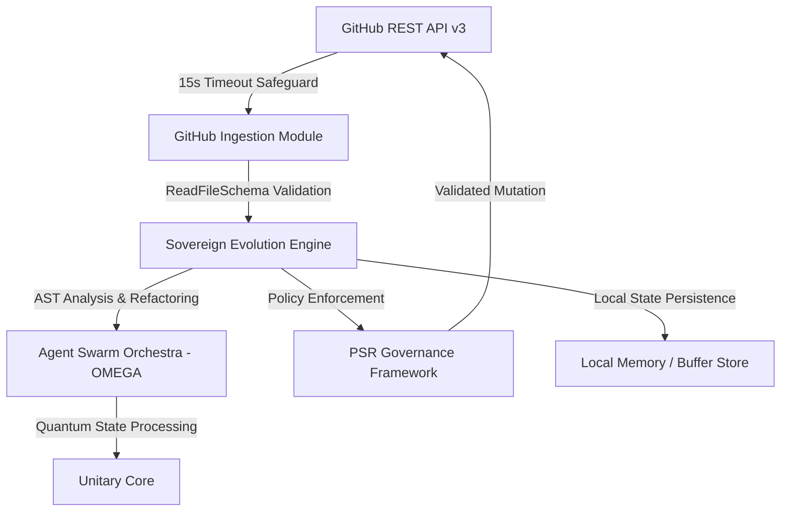

/* DARLEK CAAN RAG SYNTHESIS - Autonomous Generation G-15 [2026-09-20T05:09:44.369Z] */
# DARLEK CANN v3.0: Sovereign Architectural Blueprint

## Executive Summary

The DARLEK CANN (OMEGA-CORE) architecture represents an autonomous, self-refactoring evolutionary runtime environment. Operating at the intersection of multi-tier LLM fallbacks, agent swarm orchestration, and deterministic state persistence, the system autonomously evolves its codebase while maintaining zero-trust security and operational stability.

---

## 1. System Topology & Layered Architecture



### Key Subsystems

| Layer / Module | Architectural Role | Operational Focus |
| :--- | :--- | :--- |
| **GitHub Ingestion Engine** | REST API v3 Ingestion Layer | Base64 payload decoding, schema validation via `ReadFileSchema`, 15s `AbortController` timeout protection. |
| **Sovereign Engine (v89.1)** | Autonomous Evolution Loop | AST parsing, code refactoring, logic drift recovery, runtime mutation execution. |
| **Agent Swarm (OMEGA)** | Emergent Reasoning Engine | Multi-tier LLM routing, sub-agent task distribution, consensus calculation. |
| **Unitary Core** | Quantum State Simulator | Multi-dimensional state vector analysis and tensor memory projection. |
| **PSR Governance** | Operational Safeguard | Policy enforcement, cryptographic audit trailing, zero-trust validation before state commit. |

---

## 2. GitHub API Integration Specification

The GitHub API Integration Module operates as the foundational data ingestion interface for `Darlek Caan`.

### Ingestion Flow & Operational Constraints

1. **Validation**: Direct request validation via Zod (`ReadFileSchema`) prior to network execution.
2. **Network Protocol**: GitHub REST API v3 with mandatory `AbortController` enforcement (hard capped at 15,000ms).
3. **Payload Transformation**: Automatic Base64 string decoding paired with SHA/Path/Size metadata extraction.
4. **State Delivery**: Delivery of decoded payload to the `Darlek Caan` core for real-time refactoring analysis.

```typescript
// Architectural Ingestion Contract Interface
export interface RepositoryStatePayload {
  sha: string;
  path: string;
  size: number;
  content: string; // Fully decoded UTF-8 representation
  retrievedAt: string; // ISO 8601 Timestamp
}
```

---

## 3. Autonomous Evolution & Self-Refactoring Workflow

The system maintains self-healing and optimization capabilities through a four-phase closed loop:

1. **Drift & Performance Detection**:
   Continuous telemetry inspection identifies performance degradation, type errors, or logic drift.
2. **AST Refactoring Engine**:
   The Sovereign Evolution Engine generates AST transformations, modernizing syntax and enhancing performance while preserving functional equivalence.
3. **PSR Safety & Schema Verification**:
   The proposed mutation is passed through the `PSR-Governance` validation pipeline, ensuring no breaking changes or security key leaks occur.
4. **Autonomous Commit / Dispatch**:
   Validated changes are dispatched via the GitHub API Integration Module with explicit SHA matching for optimistic concurrency control.

---

## 4. Security, Memory & Persistence Protocols

### 4.1 Vault & Exclusions Safeguard
- **Zero Local State Leakage**: Memory dumps (`*.memory.json`) and local state caches (`*.buffer`) are strictly bound to local scope via `.gitignore`.
- **Secrets Management**: Cryptographic credentials, API tokens, and vault configurations are never serialized into version-controlled blobs.

### 4.2 Local Persistence Buffering
- **Resilience Strategy**: Uncommitted agent state vectors are stored locally in atomic `*.buffer` binary files, enabling instant state recovery across network boundaries or process crashes.

---

## 5. System Execution Pipeline

```
[Target Context] ──► [Schema Validation] ──► [Fetch & Decode Payload]
                                                     │
                                                     ▼
[Target File Update] ◄── [Governance Audit] ◄── [Agent Swarm Refactor]
```
